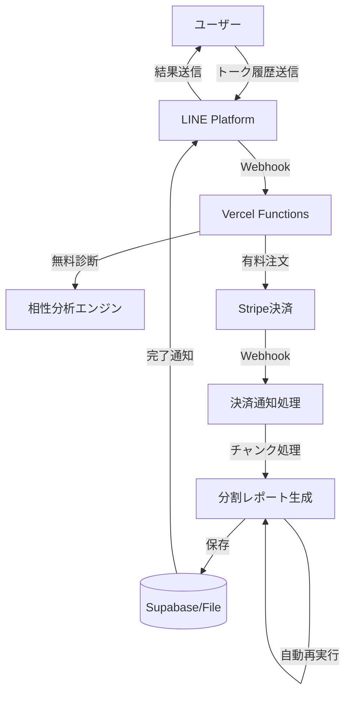

# システムアーキテクチャ

## 🏗️ 全体構成



## 📊 データフロー

### 1. 無料診断フロー
```
1. ユーザー → LINE → Webhook受信
2. トーク履歴をパース
3. 5つの指標で分析：
   - 時間（返信タイミング）
   - バランス（メッセージ頻度）
   - テンポ（会話速度）
   - タイプ（会話スタイル）
   - 言葉（言葉遣い）
4. 干支タイプ判定
5. カルーセル形式で返信
```

### 2. プレミアムレポートフロー
```
1. ユーザー → 「プレミアムレポート」
2. 注文作成 → Stripe決済URLを返信
3. ユーザー → Stripe決済ページ
4. 決済完了 → Webhook通知
5. チャンク処理開始：
   - Step 1: データ取得（5秒）
   - Step 2: 基本分析（15秒）  
   - Step 3: AI分析（20秒）
   - Step 4: PDF生成（10秒）
   - Step 5: 保存・通知（5秒）
6. 45秒で一時停止 → 進捗保存
7. 5秒後に自動再開
8. 完了 → ユーザーに通知
```

## 🔄 チャンク処理の仕組み

### タイムアウト対策
Vercelの60秒制限を回避するため、処理を分割実行：

```javascript
// 50秒で安全に停止
const TIME_LIMIT = 50000; // Vercelの60秒制限に対して余裕

if (elapsed + nextStepTime > TIME_LIMIT) {
  // 進捗を保存
  await saveProgress(orderId, currentStep, data);
  
  // 3秒後に自動再開
  setTimeout(() => {
    fetch('/api/generate-report-chunked', {
      body: { orderId }
    });
  }, 3000);
  
  return { status: 'continuing', autoTriggered: true };
}
```

### AI分析の特別処理
Step 3のAI分析は最大時間がかかるため、特別な処理を実装：

```javascript
// 30秒タイムアウトでバックグラウンド継続
const aiAnalysisPromise = reportGenerator.getAIInsights(messages, fortune);
const timeoutPromise = new Promise((_, reject) => 
  setTimeout(() => reject(new Error('timeout')), 30000)
);

try {
  const result = await Promise.race([aiAnalysisPromise, timeoutPromise]);
} catch (timeoutError) {
  // バックグラウンドで継続
  aiAnalysisPromise.then(result => {
    // 完了時に結果を保存
    progress.data.aiInsights = result;
    saveProgress(orderId, progress);
  });
  
  // 5秒後に再チェック（最大5分間待機）
  setTimeout(() => checkAIStatus(orderId), 5000);
}
```

### 進捗管理
```json
{
  "currentStep": 3,
  "totalSteps": 5,
  "data": {
    "messages": [...],
    "userProfile": {...},
    "fortune": {...},
    "aiInsights": {...},
    "aiAnalysisInProgress": true,  // AI分析進行中フラグ
    "aiAnalysisStartTime": "2025-01-08T10:00:00Z"
  },
  "attempts": 2,
  "errorCount": 0,  // エラーリトライ回数
  "startedAt": "2025-01-08T10:00:00Z"
}
```

### エラーハンドリング
各ステップでエラーが発生した場合、最大3回までリトライ：

```javascript
catch (stepError) {
  progress.errorCount = (progress.errorCount || 0) + 1;
  
  if (progress.errorCount < 3) {
    // 5秒後にリトライ
    setTimeout(() => {
      fetch('/api/generate-report-chunked', { 
        body: { orderId } 
      });
    }, 5000);
    
    return { status: 'continuing', retryCount: progress.errorCount };
  }
  
  // 3回失敗したら次のステップへ
  progress.currentStep++;
  progress.errorCount = 0;
}
```

## 💾 データストレージ

### Supabase（推奨）
```sql
orders テーブル:
- id: 注文ID
- user_id: LINEユーザーID
- status: pending/paid/generating/completed/error
- report_progress: JSONB（進捗データ）
- pdf_data: TEXT（Base64エンコードPDF）
- created_at/updated_at: タイムスタンプ
```

### ファイルストレージ（フォールバック）
```
orders/
├── ORDER_xxx.json    # 注文情報
├── ORDER_xxx.pdf     # PDFファイル
progress/
└── ORDER_xxx.json    # 進捗情報
```

## 🔑 環境変数

### 必須
- `CHANNEL_SECRET`: LINE Bot認証用
- `CHANNEL_ACCESS_TOKEN`: LINE API通信用
- `BASE_URL`: アプリケーションURL

### プレミアム機能
- `STRIPE_SECRET_KEY`: Stripe API認証
- `STRIPE_WEBHOOK_SECRET`: Webhook署名検証

### オプション
- `SUPABASE_URL/ANON_KEY`: データベース接続
- `OPENAI_API_KEY`: AI分析機能
- `FORCE_FILE_STORAGE`: ファイル強制使用

## 🚀 デプロイ構成

### Vercel Functions
```
/api/main.js                → /webhook
/api/stripe-webhook-simple  → Stripe通知
/api/generate-report-chunked → チャンク処理
/api/view-report            → PDF表示
```

### 関数設定（vercel.json）
```json
{
  "functions": {
    "api/stripe-webhook-simple.js": {
      "maxDuration": 60
    },
    "api/generate-report-chunked.js": {
      "maxDuration": 60
    }
  }
}
```

## 🔍 監視ポイント

### ログで確認する項目
1. **処理開始/再開**
   - `🆕 Starting new report generation`
   - `♻️ Resuming from step X`

2. **進捗状況**
   - `📍 Step X/5`
   - `⏱️ Step X took Xms`

3. **一時停止/再開**
   - `⏸️ Pausing before step X`
   - `🔄 Auto-continuing from step X`

4. **完了/エラー**
   - `🎉 Report generation completed!`
   - `❌ Error in step X`

### データベース確認
```sql
-- 生成中の注文を確認
SELECT id, status, report_progress->>'currentStep' as step
FROM orders 
WHERE status = 'generating';

-- エラー注文を確認
SELECT id, error_message, created_at
FROM orders
WHERE status = 'error'
ORDER BY created_at DESC;
```

## 🛠️ メンテナンス

### 定期的な確認項目
1. **ディスク容量**（ファイルストレージ使用時）
2. **データベース容量**（Supabase無料枠500MB）
3. **API使用量**（OpenAI/Stripe）
4. **エラーログ**（Vercel Functions）

### クリーンアップ
```javascript
// 古い進捗データを削除
await ordersDB.cleanupOldProgress(30); // 30日以上前

// 完了済み注文のPDFデータを削除（外部保存後）
await ordersDB.clearPDFData('completed', 7); // 7日後
```

## 📈 パフォーマンス最適化

### 処理時間の目安
- 基本分析: 5-10秒
- AI分析: 15-25秒（OpenAI使用時）
- PDF生成: 5-10秒
- 全体: 40-60秒（チャンク処理で分割）

### 最適化ポイント
1. **AI分析のタイムアウト**（5秒）
2. **メッセージ数の制限**（最新15件）
3. **HTMLベースのPDF**（実PDF変換は重い）
4. **並列処理の活用**（Promise.all）

## 🔐 セキュリティ

### 認証と検証
- LINE署名検証（X-Line-Signature）
- Stripe Webhook署名検証
- 環境変数での秘密鍵管理

### データ保護
- トーク履歴の即時破棄
- 個人情報の最小保存
- Base64エンコードでPDF保存

### アクセス制御
- 注文IDによる認証
- ユーザーIDの検証
- タイムアウトによる自動削除