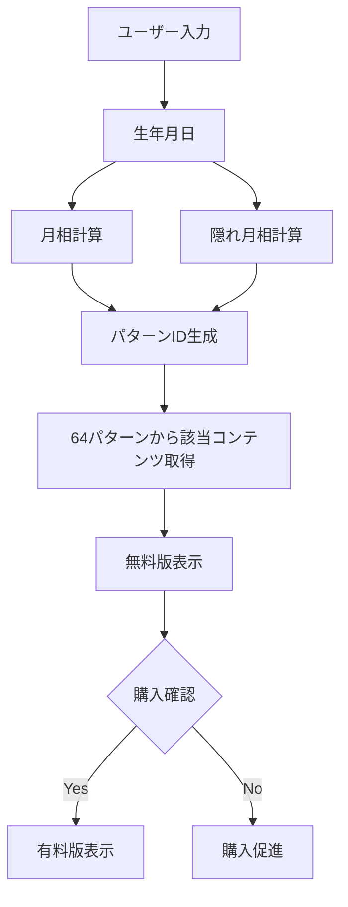

# 🛠️ おつきさま診断 実装ガイド

## 📌 このガイドの目的
エンジニアが「おつきさま診断」を実装・修正する際の完全なリファレンスガイド

---

## 🏗️ アーキテクチャ概要

### 技術スタック
- **フロントエンド**: Vanilla JavaScript + HTML + CSS
- **グラフ**: Chart.js
- **アニメーション**: CSS Animation + JavaScript
- **レスポンシブ**: CSS Media Queries

### ファイル構造
```
/public/
  └── lp-otsukisama.html    # メインファイル（HTML/CSS/JS統合）
  
/docs/
  ├── OTSUKISAMA_FINAL_SPEC_2025.md        # 最終仕様書
  ├── OTSUKISAMA_IMPLEMENTATION_GUIDE.md   # 本ガイド
  ├── otsukisama_complete_all_64_patterns.md  # パターン1-8
  ├── otsukisama_patterns_9-20.md          # パターン9-20
  ├── otsukisama_patterns_21-36.md         # パターン21-36
  ├── otsukisama_patterns_37-48.md         # パターン37-48
  ├── otsukisama_patterns_49-64.md         # パターン49-64
  └── moon_calendar_64_patterns.md         # カレンダーデータ
```

---

## 🔑 コア実装

### 1. 月相計算ロジック

```javascript
// 生年月日から月相を計算
function calculateMoonPhase(year, month, day) {
    const birthDate = new Date(year, month - 1, day);
    const newMoonBase = new Date(2000, 0, 6); // 基準日
    const lunarCycle = 29.53059; // 朔望月
    
    const daysSince = Math.floor((birthDate - newMoonBase) / (1000 * 60 * 60 * 24));
    const moonAge = ((daysSince % lunarCycle) + lunarCycle) % lunarCycle;
    
    // 8つの月相に分類
    if (moonAge < 1.5) return 0; // 新月
    if (moonAge < 6) return 1;   // 三日月
    if (moonAge < 9) return 2;   // 上弦
    if (moonAge < 12) return 3;  // 十三夜
    if (moonAge < 16.5) return 4; // 満月
    if (moonAge < 20) return 5;  // 十六夜
    if (moonAge < 24) return 6;  // 下弦
    return 7; // 暁
}
```

### 2. 隠れ月相計算

```javascript
// 隠れ月相（裏の顔）を計算
function calculateHiddenMoonPhase(moonPhase, birthMonth, birthDay) {
    // 生日の数字根を計算
    function getDigitRoot(num) {
        while (num >= 10) {
            num = Math.floor(num / 10) + (num % 10);
        }
        return num;
    }
    
    const dayRoot = getDigitRoot(birthDay);
    const hiddenPhase = (moonPhase + birthMonth + dayRoot) % 8;
    
    return hiddenPhase;
}
```

### 3. パターンID生成

```javascript
// 64パターンのIDを生成
function getPatternId(moonPhase, hiddenPhase) {
    return moonPhase * 10 + hiddenPhase;
    // 例: 新月(0) × 三日月(1) = 01
}
```

---

## 📊 運勢グラフ実装

### Chart.js設定

```javascript
function createFortuneChart(patternId) {
    // データ取得（fortune_graph_all_64_patterns.jsonから）
    const fortuneData = getFortuneData(patternId);
    
    const ctx = document.getElementById('fortuneChart').getContext('2d');
    
    new Chart(ctx, {
        type: 'line',
        data: {
            labels: [
                '1週目', '2週目', '3週目', '4週目',
                '5週目', '6週目', '7週目', '8週目',
                '9週目', '10週目', '11週目', '12週目'
            ],
            datasets: [{
                label: '総合運',
                data: fortuneData.overall,
                borderColor: '#ffd700',
                backgroundColor: 'rgba(255, 215, 0, 0.1)',
                tension: 0.4,
                borderWidth: 3,
                pointRadius: 6,
                pointBackgroundColor: '#fff',
                pointBorderColor: '#ffd700',
                pointBorderWidth: 2
            }]
        },
        options: {
            responsive: true,
            maintainAspectRatio: false,
            scales: {
                y: {
                    min: 1,
                    max: 5,
                    ticks: {
                        stepSize: 1,
                        callback: function(value) {
                            const labels = {
                                5: '絶好調',
                                4: '好調',
                                3: '安定',
                                2: '注意',
                                1: '低調'
                            };
                            return labels[value];
                        }
                    }
                }
            },
            plugins: {
                legend: {
                    display: false
                },
                tooltip: {
                    callbacks: {
                        label: function(context) {
                            const fortuneLevel = context.parsed.y;
                            const labels = {
                                5: '絶好調',
                                4: '好調',
                                3: '安定',
                                2: '注意',
                                1: '低調'
                            };
                            return `総合運: ${labels[fortuneLevel]}`;
                        }
                    }
                }
            }
        }
    });
}
```

---

## 🎨 デザイン実装

### バナースタイルの使い分け

```javascript
// バナータイプを判定して適用
function applyBannerStyle(section) {
    const bannerMap = {
        'fortune': 'banner-supreme',     // 最重要
        'love': 'banner-supreme',        // 最重要
        'work': 'banner-secondary',      // 中重要
        'relationship': 'banner-secondary', // 中重要
        'moonphase': 'banner-decorative' // 装飾的
    };
    
    const bannerClass = bannerMap[section] || 'banner-title';
    return bannerClass;
}
```

### スクロール進捗バー

```javascript
// スクロール進捗バーの更新
window.addEventListener('scroll', () => {
    const scrollProgress = document.querySelector('.scroll-progress');
    const scrollHeight = document.documentElement.scrollHeight - window.innerHeight;
    const scrolled = (window.scrollY / scrollHeight) * 100;
    scrollProgress.style.width = scrolled + '%';
});
```

---

## 📝 コンテンツ表示ロジック

### 64パターンコンテンツの取得

```javascript
// パターンIDからコンテンツを取得
async function getPatternContent(patternId) {
    // パターンIDからファイルを特定
    let fileMap = {
        '00-07': 'otsukisama_complete_all_64_patterns.md',
        '10-17': 'otsukisama_patterns_9-20.md',
        '20-36': 'otsukisama_patterns_21-36.md',
        '37-48': 'otsukisama_patterns_37-48.md',
        '49-67': 'otsukisama_patterns_49-64.md'
    };
    
    // 該当ファイルからコンテンツを抽出
    const content = await fetchAndParseContent(patternId);
    
    return {
        overall: content.overall,      // 600文字
        love: content.love,            // 500文字
        relationship: content.relationship, // 450文字
        work: content.work,            // 450文字
        money: content.money           // 400文字
    };
}
```

### 無料/有料の切り替え

```javascript
// 有料版コンテンツの表示制御
function togglePaidContent(isPaid) {
    const paidSections = document.querySelectorAll('.paid-content');
    const paywall = document.querySelector('.paywall');
    
    if (isPaid) {
        // 有料版を表示
        paidSections.forEach(section => {
            section.style.display = 'block';
            section.classList.add('fade-in');
        });
        paywall.style.display = 'none';
    } else {
        // 無料版のみ表示
        paidSections.forEach(section => {
            section.style.display = 'none';
        });
        paywall.style.display = 'block';
    }
}
```

---

## 🔄 データフロー



---

## ⚠️ 注意事項

### 1. 文字数の厳守
```javascript
// コンテンツ検証
function validateContent(content) {
    const limits = {
        overall: 600,
        love: 500,
        relationship: 450,
        work: 450,
        money: 400
    };
    
    for (const [key, limit] of Object.entries(limits)) {
        if (content[key].length !== limit) {
            console.warn(`${key}の文字数が不正: ${content[key].length}文字 (期待値: ${limit}文字)`);
        }
    }
}
```

### 2. 時期表現の統一
```javascript
// 時期表現の変換
function formatPeriod(monthOffset) {
    // 固定月名を使わない
    return `診断から${monthOffset}ヶ月目`;
    // NOT: "1月", "2月", etc.
}
```

### 3. レスポンシブ対応
```javascript
// デバイス判定
function isMobile() {
    return window.innerWidth <= 768;
}

// モバイル用調整
if (isMobile()) {
    // フォントサイズ調整
    document.body.style.fontSize = '16px';
    // スクロールヒント表示
    document.querySelector('.scroll-hint').style.display = 'block';
}
```

---

## 🧪 テストポイント

### 必須テストケース

1. **月相計算の正確性**
   - 各月相の境界値テスト
   - うるう年対応

2. **64パターンの網羅性**
   - 全パターンのコンテンツ存在確認
   - 文字数チェック

3. **レスポンシブ表示**
   - iPhone/Android各種サイズ
   - タブレット表示

4. **パフォーマンス**
   - 初期表示3秒以内
   - スクロールの滑らかさ

5. **ブラウザ互換性**
   - Chrome/Safari/Firefox/Edge
   - iOS Safari対応

---

## 🚀 デプロイチェックリスト

- [ ] 全64パターンのコンテンツ確認
- [ ] Chart.jsの正常動作
- [ ] レスポンシブデザインの確認
- [ ] 文字数の検証
- [ ] アニメーションのパフォーマンス
- [ ] 購入フローのテスト
- [ ] エラーハンドリング
- [ ] アクセシビリティチェック

---

## 📚 関連ドキュメント

- **仕様書**: `OTSUKISAMA_FINAL_SPEC_2025.md`
- **64パターン**: `otsukisama_patterns_*.md`
- **月齢カレンダー**: `moon_calendar_64_patterns.md`
- **グラフ仕様**: `fortune_graph_specification_simple.md`

---

## 💡 トラブルシューティング

### よくある問題と解決法

#### 1. 月相計算がずれる
```javascript
// タイムゾーン考慮
const birthDate = new Date(year, month - 1, day, 12, 0, 0); // 正午で計算
```

#### 2. Chart.jsが表示されない
```javascript
// DOMContentLoaded後に初期化
document.addEventListener('DOMContentLoaded', () => {
    createFortuneChart(patternId);
});
```

#### 3. モバイルでアニメーションが重い
```css
@media (max-width: 768px) {
    * {
        animation-duration: 0s !important; /* アニメーション無効化 */
    }
}
```

---

更新日: 2025-01-27