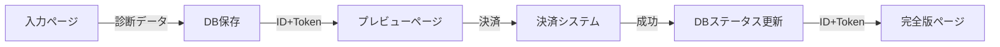

# おつきさま診断ページ分割実装計画

## 概要
現在の単一ページ構成から、決済フローに対応した3ページ構成へ移行する。

## 現状の課題
- 情報入力と結果表示が同一ページ内
- 決済フローが組み込めない
- 有料コンテンツと無料コンテンツの分離ができない
- URLが固定で結果ページの共有ができない

## 実装方針

### ページ構成
```
1. 入力ページ (lp-otsukisama-input.html)
   - 名前・生年月日の入力フォーム
   - 診断開始

2. プレビューページ (lp-otsukisama-preview.html)
   - 無料コンテンツの表示
   - 有料コンテンツのぼかし表示
   - 決済への導線（CTAボタン）

3. 完全版ページ (lp-otsukisama-result.html)
   - 全コンテンツの表示
   - 共有機能
```

### アーキテクチャ設計

#### 共通コンポーネント方式
1つのコンテンツ定義ファイルで両ページ（プレビュー/完全版）を管理

```
/public/
├── lp-otsukisama-input.html      # 入力ページ
├── lp-otsukisama-preview.html    # プレビューページ
├── lp-otsukisama-result.html     # 完全版ページ
├── css/
│   └── lp-otsukisama.css         # 共通CSS（既存）
└── js/
    ├── lp-otsukisama-content.js  # コンテンツ定義（新規）
    ├── lp-otsukisama-render.js   # レンダリングロジック（新規）
    └── lp-otsukisama-display.js  # 表示ロジック（既存・改修）
```

### データフロー



### データベース設計

```sql
CREATE TABLE moon_diagnosis (
  id UUID DEFAULT gen_random_uuid() PRIMARY KEY,
  user_name TEXT NOT NULL,
  birth_date DATE NOT NULL,
  moon_phase TEXT NOT NULL,
  hidden_phase TEXT NOT NULL,
  pattern_id INTEGER NOT NULL,
  payment_status TEXT DEFAULT 'pending', -- pending, paid, expired
  payment_date TIMESTAMP,
  access_token TEXT UNIQUE,
  created_at TIMESTAMP DEFAULT NOW(),
  updated_at TIMESTAMP DEFAULT NOW()
);
```

## 実装詳細

### 1. コンテンツ管理（lp-otsukisama-content.js）

```javascript
const DIAGNOSIS_CONTENT = {
  sections: {
    // 月相診断結果
    moonPhaseResult: {
      id: 'moon-phase-result',
      title: 'あなたの月相',
      html: () => `<div class="moon-phase-result">...</div>`,
      freePreview: true,  // プレビューで表示
      order: 1
    },
    
    // 性格タイプ
    personalityTypes: {
      id: 'personality-types',
      title: '4つの性格軸',
      html: () => `<div class="personality-types">...</div>`,
      freePreview: true,  // タイトルのみ表示
      previewMode: 'partial' // 部分表示
      order: 2
    },
    
    // 恋愛運
    loveFortune: {
      id: 'love-fortune',
      title: '恋愛運',
      html: () => `<div class="love-fortune">...</div>`,
      freePreview: false, // 有料コンテンツ
      order: 3
    },
    
    // 他のセクション...
  }
};
```

### 2. レンダリングロジック（lp-otsukisama-render.js）

```javascript
class DiagnosisRenderer {
  constructor(mode = 'preview') {
    this.mode = mode; // 'preview' or 'full'
  }
  
  render(containerId, data) {
    const container = document.getElementById(containerId);
    const sections = this.getSortedSections();
    
    sections.forEach(section => {
      if (this.shouldRender(section)) {
        container.appendChild(this.renderSection(section, data));
      }
    });
  }
  
  shouldRender(section) {
    return this.mode === 'full' || section.freePreview;
  }
  
  renderSection(section, data) {
    const element = document.createElement('div');
    element.className = `section-${section.id}`;
    
    if (this.mode === 'preview' && !section.freePreview) {
      // ぼかし表示
      element.classList.add('content-locked');
      element.innerHTML = this.createLockedContent(section);
    } else {
      // 通常表示
      element.innerHTML = section.html(data);
    }
    
    return element;
  }
  
  createLockedContent(section) {
    return `
      <div class="locked-overlay">
        <h3>${section.title}</h3>
        <div class="blurred-content">
          ${this.getPlaceholderContent(section)}
        </div>
        <div class="unlock-prompt">
          <span class="lock-icon">🔒</span>
          <p>このコンテンツを見るには診断を購入してください</p>
        </div>
      </div>
    `;
  }
}
```

### 3. 表示制御CSS

```css
/* コンテンツロック表示 */
.content-locked {
  position: relative;
  min-height: 200px;
  overflow: hidden;
}

.content-locked .blurred-content {
  filter: blur(8px);
  opacity: 0.3;
  pointer-events: none;
  user-select: none;
}

.content-locked .unlock-prompt {
  position: absolute;
  top: 50%;
  left: 50%;
  transform: translate(-50%, -50%);
  text-align: center;
  background: rgba(255, 255, 255, 0.95);
  padding: 30px;
  border-radius: 15px;
  box-shadow: 0 4px 20px rgba(0, 0, 0, 0.1);
}

.lock-icon {
  font-size: 48px;
  display: block;
  margin-bottom: 15px;
}
```

## セキュリティ考慮事項

1. **有料コンテンツの保護**
   - 完全版のコンテンツはサーバーサイドから取得
   - クライアントサイドには最小限のデータのみ

2. **アクセストークン管理**
   - 一時的なトークンでアクセス制御
   - 有効期限の設定

3. **決済状態の検証**
   - サーバーサイドで決済状態を確認
   - クライアントサイドの改ざん対策

## 実装ステップ

1. ✅ 実装計画の作成（このドキュメント）
2. ⏳ 入力ページの作成
3. ⏳ プレビューページの作成
4. ⏳ 完全版ページの作成
5. ⏳ 共通コンテンツモジュールの作成
6. ⏳ レンダリングロジックの実装
7. ⏳ データベース保存機能の実装
8. ⏳ 決済フローの統合
9. ⏳ テストと検証

## メリット

1. **メンテナンス性向上**
   - コンテンツ修正が1箇所で完結
   - 自動的に両ページに反映

2. **拡張性**
   - 新しいセクション追加が容易
   - 表示制御の柔軟な設定

3. **ユーザー体験**
   - 明確な価値提示（プレビュー）
   - スムーズな決済フロー
   - 結果ページの共有可能

## 次のアクション

この設計に基づいて、以下の順序で実装を進める：
1. 現在のHTMLから必要な要素を抽出
2. 3つのHTMLページを作成
3. 共通JSモジュールの実装
4. データベース連携の実装