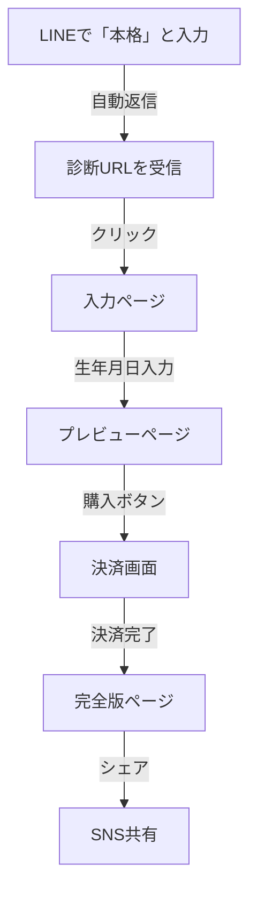

# おつきさま診断 - ユーザーフロー

## 全体の流れ



## 詳細フロー

### 1. LINE Bot起動（エントリーポイント）

**トリガー**: LINEで「本格」と入力

**アクション**:
- LINE Botが自動返信
- 診断ページへのリンクを含むFlexメッセージを送信
- URL: `/lp-otsukisama-input.html?userId=XXX`

**表示内容**:
```
🌙 本格おつきさま診断 🌙
直近3ヶ月の詳細運勢

あなたの生まれた瞬間の月の形から
導き出される
あなただけの詳細な運勢

• 直近3ヶ月の運勢グラフ
• 恋愛・仕事・金運の詳細予測
• 月相別の開運アドバイス
• あなただけの月齢カレンダー

[今すぐ診断を始める]
```

### 2. 入力ページ (`lp-otsukisama-input.html`)

**URL**: `/lp-otsukisama-input.html?userId=XXX`

**入力項目**:
- お名前（ニックネーム可）
- 生年月日（年・月・日）

**処理**:
1. フォーム入力
2. 月相パターンの計算（0-63）
3. データをローカルストレージに保存
4. プレビューページへリダイレクト

### 3. プレビューページ (`lp-otsukisama-preview.html`)

**URL**: `/lp-otsukisama-preview.html?id=XXX`

**表示内容**:

#### 無料コンテンツ（通常表示）
- ✅ 月詠の挨拶
- ✅ 月相診断結果（表の月相 × 隠された月相）
- ✅ 4つの性格軸（見出しのみ）

#### 有料コンテンツ（ぼかし表示 + 🔒）
- 🔒 性格タイプの詳細解説
- 🔒 直近3ヶ月の全体運
- 🔒 恋愛運の詳細
- 🔒 人間関係運
- 🔒 仕事運
- 🔒 金運
- 🔒 月からの最終メッセージ

**CTA（Call to Action）**:
```
🌙 完全版で全ての運勢を解放しましょう

✨ 全ての運勢詳細
💝 恋愛運の完全解析
💰 金運アップの秘訣
📅 3ヶ月の詳細予測

通常価格 ¥9,800
特別価格 ¥2,980（税込）

[今すぐ完全版を購入する]

💳 クレジットカード
📱 Apple Pay
💠 Google Pay
```

### 4. 決済処理

**決済方法**: （今後実装予定）
- Stripe
- PayPay
- その他

**処理フロー**:
1. 診断IDを決済システムに送信
2. 決済完了後、DBのpayment_statusを'paid'に更新
3. 完全版ページへリダイレクト

### 5. 完全版ページ (`lp-otsukisama-result.html`)

**URL**: `/lp-otsukisama-result.html?id=XXX&token=YYY`

**アクセス制御**:
- payment_status = 'paid' の確認
- トークン検証

**表示内容**:
- 全コンテンツを制限なしで表示
- お礼メッセージ
- 共有ボタン
- ダウンロード機能

**共有機能**:
- LINE共有
- X（Twitter）共有
- Facebook共有
- URLコピー

## データ管理

### ローカルストレージ（現在）
```javascript
{
  name: "ユーザー名",
  birthDate: "1990-01-01",
  patternId: 42,
  timestamp: "2024-01-01T00:00:00Z"
}
```

### データベース（今後実装）
```sql
moon_diagnosis {
  id: UUID,
  user_name: TEXT,
  birth_date: DATE,
  moon_phase: TEXT,
  hidden_phase: TEXT,
  pattern_id: INTEGER,
  payment_status: TEXT, -- pending/paid
  payment_date: TIMESTAMP,
  access_token: TEXT,
  created_at: TIMESTAMP
}
```

## コンテンツ編集方法

### 重要: 1箇所編集で両ページ反映

**編集ファイル**: `/public/js/lp-otsukisama-content.js`

```javascript
// 例：新しいセクションを追加
newSection: {
  id: 'new-section',
  title: '新しいセクション',
  freePreview: false,  // false = 有料コンテンツ
  order: 12,
  html: (data) => `
    <div>新しいコンテンツ</div>
  `
}
```

このファイルを編集すると、プレビューページと完全版ページの両方に自動的に反映されます。

## セキュリティ考慮事項

1. **有料コンテンツの保護**
   - プレビューではぼかし表示
   - 完全版は決済確認後のみアクセス可能

2. **アクセストークン**
   - 一時的なトークンで管理
   - 有効期限の設定（今後実装）

3. **決済状態**
   - サーバーサイドで管理
   - クライアントサイドの改ざん対策

## テスト方法

### ローカルテスト
```bash
# 開発サーバー起動
npm run dev

# 各ページにアクセス
http://localhost:3001/lp-otsukisama-input.html
http://localhost:3001/lp-otsukisama-preview.html?id=test
http://localhost:3001/lp-otsukisama-result.html?id=test
```

### LINEボットテスト
1. LINEで「本格」と送信
2. 返信されたリンクをクリック
3. フロー通りに進行することを確認

## トラブルシューティング

### Q: プレビューページが表示されない
A: ローカルストレージにデータが保存されているか確認
```javascript
localStorage.getItem('otsukisama_diagnosis')
```

### Q: 有料コンテンツが見えてしまう
A: レンダリングモードを確認
```javascript
// プレビューページ
new DiagnosisRenderer('preview')

// 完全版ページ
new DiagnosisRenderer('full')
```

### Q: コンテンツが更新されない
A: ブラウザキャッシュをクリア、またはシークレットモードで確認

## 今後の実装予定

- [ ] データベース連携
- [ ] 決済システム統合（Stripe）
- [ ] PDF生成機能
- [ ] メール送信機能
- [ ] アクセス解析
- [ ] A/Bテスト機能